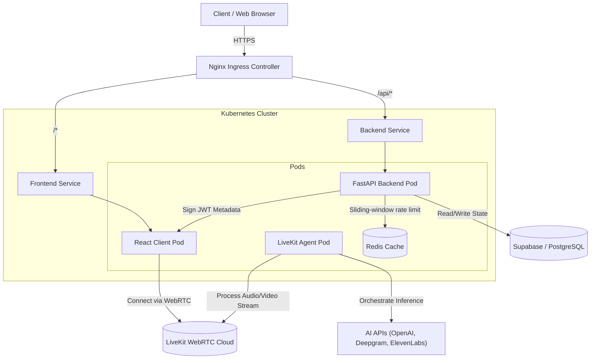

# 🗺️ MoNiCa.AI: System Architecture & Data Flow

This outlines the master backend and infrastructure architecture for MoNiCa.AI. The system is deployed as a suite of microservices on Kubernetes, leveraging WebRTC for low-latency media processing.

## 🏗️ Infrastructure Map (Kubernetes)

## ⚙️ Core Backend Components

### 1. FastAPI Gateway (`server.py`)
*   **Role**: Serves as the primary REST API and session manager.
*   **Responsibilities**:
    *   Generates secure, cryptographically signed JWTs containing user intent, role, and interview mode.
    *   Manages API rate limiting (Redis-backed sliding-window, 5 req/min per IP) and health checks (`/healthz`) for Kubernetes Liveness/Readiness probes. Falls back to in-memory when Redis is unavailable.
    *   Stores and retrieves comprehensive interview reports from PostgreSQL.

### 2. Redis Cache (`redis:alpine`)
*   **Role**: In-memory data store for high-speed ephemeral state.
*   **Responsibilities**:
    *   Powers the sliding-window rate limiter using a Redis sorted set (ZSET). Each request is stamped with a score equal to its Unix timestamp; entries older than 60 s are evicted atomically before counting.
    *   Designed to be the foundation for future background task queues (session audio processing, score computation) and session caching.
    *   Runs as a sidecar service in Docker Compose; the backend waits for a `redis-cli ping` healthcheck before starting.

### 3. The AI Worker Agent (`agent.py` & `prompts.py`)
*   **Role**: An asynchronous, highly concurrent worker node connected to the LiveKit WebRTC server.
*   **Responsibilities**:
    *   **VAD (Voice Activity Detection):** Detects user speech starts and stops locally.
    *   **STT (Speech-to-Text):** Streams audio chunks to Deepgram for real-time transcription.
    *   **LLM Inference:** Injects context via `prompts.py` based on JWT metadata, generating dynamic responses via OpenAI.
    *   **TTS (Text-to-Speech) & Visuals:** Streams LLM text to ElevenLabs for natural voice synthesis, and maps output to 3D avatar visual APIs (Tavus/Simli) at 12-24 FPS.

### 4. Persistence Layer (`database.py`)
*   **Role**: State and data durability.
*   **Responsibilities**: Uses Supabase (PostgreSQL) for cloud environments, allowing multi-pod deployment in Kubernetes to share state regarding generated reports, user sessions, and telemetry metrics.
