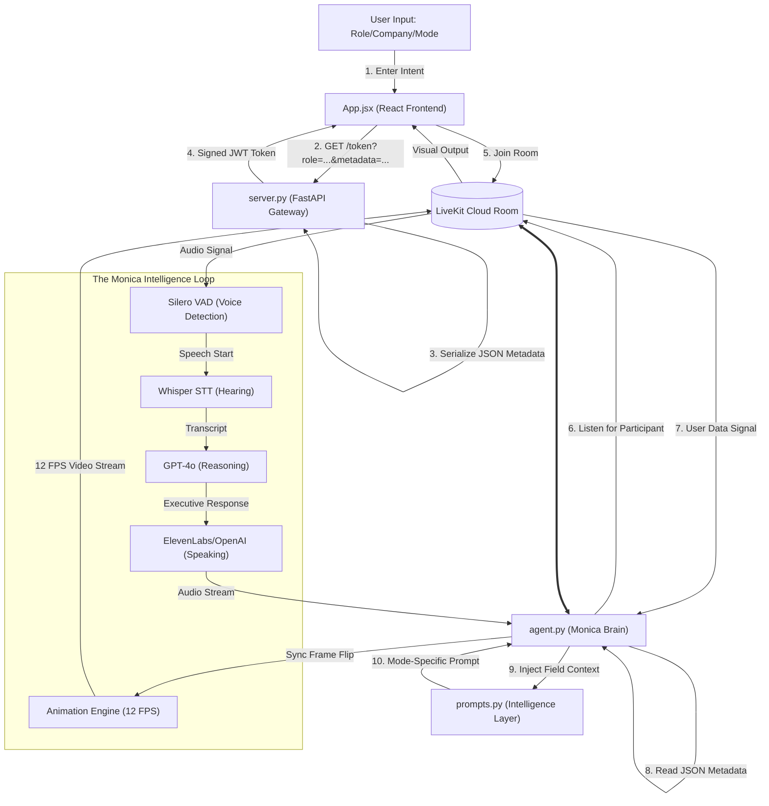

# 🗺️ Monica AI: Editable Universal System Map

This is the **Master Technical Blueprint**. It is built using **Mermaid Text Architecture**, meaning you can **directly edit the code below** to update the map as the project grows.

## 🤝 The Live Flowchart (Editable Boxes & Lines)

---

## 🛠️ How to Update This Map
This map is written in **Mermaid syntax**. As you improve the project, you can easily add new "Boxes" and "Arrows" by editing the `ARCHITECTURE.md` file:

1.  **Add a Box**: `NewBox["My New Feature"]`
2.  **Add a Line**: `OldBox -- "Does Something" --> NewBox`
3.  **Grouping**: Use `subgraph Name ... end` to box similar components together.

---

## 🏗️ Core Architecture Breakdown

### 1. **The Handshake (`server.py` + `App.jsx`)**
*   **Job**: Packages your **Role** and **Company** into a cryptographically signed JSON Web Token (JWT).
*   **Editable Metadata**: `server.py` takes the query params and puts them in `with_metadata()`.

### 2. **The Intelligence Bridge (`agent.py` + `prompts.py`)**
*   **Job**: Reads the token metadata to decide **how hard to grill you**.
*   **Dynamic Prompting**: If "Technical" is chosen, Monica swaps out her entire base instruction for the `TECHNICAL_INTERVIEW_PROMPT`.

### 3. **The Visual Motion (`agent.py`)**
*   **Job**: Manages the 12 FPS video stream of Monica.
*   **Lip-Sync Logic**: Flip frames based on speech state.

### 4. **The User Dashboard (`App.jsx`)**
*   **Job**: Renders the **Monica Executive AI** viewport and handles the user's local camera.

---

## 🛡️ Pre-Flight Bug Check Summary

| Component | Status | Fix Implemented |
| :--- | :--- | :--- |
| **Agent Logic** | ✅ PASS | Fixed Python string search (`in role` instead of `.includes()`). |
| **Animation Sync** | ✅ PASS | Verified event bindings for `agent_speech_started`. |
| **Universal Mode** | ✅ PASS | Monica now adapts to **any industry** (Nursing, Law, CEO, RA) instantly. |

---
*Created by **Stephen Agyemang**
